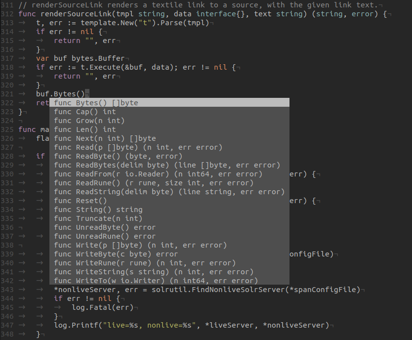

# Welcome

* Introduction to Go
* Spartakiade 2019-04-27, 10:00, Berlin, Alte Börse Marzahn
* Martin Czygan - gh/miku, @cvvfj, martin.czygan@gmail.com

# About me

* Software developer at [Leipzig University Library](http://ub.uni-leipzig.de/)
* Co-Author of Getting Started with Python Data Analysis (2015)
* Gopher since 2013
* Since 2019 Co-Host of [Go and Cloud Native Meetup Leipzig](https://golangleipzig.space/)

# About you

* ...

# Go: A timeline of events

* [The Go programming language](https://www.youtube.com/watch?v=rKnDgT73v8s), November 2009
* [Go version 1 is released](https://blog.golang.org/go-version-1-is-released), 28 March 2012

The Go 1 release marked an important milestone, which is codified in [Go 1 and
the Future of Go Programs](https://golang.org/doc/go1compat):

> Go 1 defines two things: first, the specification of the language; and
> second, the specification of a set of core APIs, the "standard packages" of
> the Go library. The Go 1 release includes their implementation in the form
> of two compiler suites (gc and gccgo), and the core libraries themselves.

> It is intended that programs written to the Go 1 specification will continue
> to compile and run correctly, unchanged, over the lifetime of that
> specification.

In Spring 2016, Brad Fitzgerald gave a talk: [Go 1.6: Asymptotically
approaching boring](https://www.youtube.com/watch?v=4Dr8FXs9aJM)
([slides](https://docs.google.com/presentation/d/1JsCKdK_AvDdn8EkummMNvpo7ntqteWQfynq9hFTCkhQ/view?slide=id.p)).

Go has releases approximately every six months (seems attractive to
[others](https://www.infoq.com/news/2017/09/Java6Month), too).

Rationale: Stable foundation - to build stuff on top.

* Language ([ref/spec](https://golang.org/ref/spec))
* Standard Library ([pkg](https://golang.org/pkg/))
* Runtime ([GC](https://www.youtube.com/watch?v=aiv1JOfMjm0), scheduler, and
  other pieces under active development)
* Tools (go, godoc, go vet, gofmt, goimports, ... under active development)
* Ecosystem (external packages, conferences, user groups, and much more)

The current release is [Go 1.11](https://blog.golang.org/go1.11) from 24 August
2018.

# Origins and influences

A multitude of ideas and influences:

* C++ might be slow to compile and bloated
* all programming languages seem to add and add features
* we are entered the multicore era
* design for a networked world
* bridge the gap between dynamic and static programming languages (be safe, yet
  ease to write)
* focus on long-term maintenance
* designed with tools in mind (gofmt being the prototypical tool)
* a different approach to concurrency
* a stripped version of object orientation

The original designers are Robert Griesemer, Rob Pike, Ken Thomson.

# Installation

The documentation can be found here:

* https://golang.org/doc/install

Binary packages are provided for Windows, macOS, Linux:

* https://golang.org/dl/

The go distribution contains the runtime, tools and standard library.

```shell
$ ls -lh go
total 200K
drwxr-xr-x  2 tir tir 4.0K Oct  1 23:02 api
-rw-r--r--  1 tir tir  54K Oct  1 23:02 AUTHORS
drwxr-xr-x  2 tir tir 4.0K Oct  1 23:15 bin
-rw-r--r--  1 tir tir 1.4K Oct  1 23:02 CONTRIBUTING.md
-rw-r--r--  1 tir tir  70K Oct  1 23:02 CONTRIBUTORS
drwxr-xr-x  8 tir tir 4.0K Oct  1 23:02 doc
-rw-r--r--  1 tir tir 5.6K Oct  1 23:02 favicon.ico
drwxr-xr-x  3 tir tir 4.0K Oct  1 23:02 lib
-rw-r--r--  1 tir tir 1.5K Oct  1 23:02 LICENSE
drwxr-xr-x 15 tir tir 4.0K Oct  1 23:15 misc
-rw-r--r--  1 tir tir 1.3K Oct  1 23:02 PATENTS
drwxr-xr-x  9 tir tir 4.0K Oct  1 23:15 pkg
-rw-r--r--  1 tir tir 1.6K Oct  1 23:02 README.md
-rw-r--r--  1 tir tir   26 Oct  1 23:02 robots.txt
drwxr-xr-x 46 tir tir 4.0K Oct  1 23:02 src
drwxr-xr-x 22 tir tir  12K Oct  1 23:14 test
-rw-r--r--  1 tir tir    8 Oct  1 23:02 VERSION
```

The Go1.12.4 Linux distribution contains 1145 directories, 8729 files.

```
$ find /usr/lib/go -type f | xargs -I {} basename {} | rev | cut -d '.' -f 1 | \
    rev | sort | uniq -c | sort -nr | head -30
   6432 go
    784 a
    532 s
    289 txt
    192 shlibname
    111 c
    106 golden
     58 src
     55 png
     42 tar
     35 sng
     35 out
     35 input
     26 zip
     25 jpeg
     24 h
     22 obj
     18 README
     18 expect-noinput
     18 bash
     16 expect
     15 in
     14 string
     14 pl
     13 rules
     13 dot
     12 nexts
     12 json
     12 gox
     10 text
```

Includes documentation and mascot:

```
$ open /usr/lib/go/misc/chrome/gophertool/gopher.png
```


For the target platform, the installation instructions are noted here:

* https://golang.org/doc/install#install

# Editors

An editor is typically enough to write Golang.

* https://golang.org/doc/editors.html

For [vim](https://github.com/fatih/vim-go),
[vscode](https://code.visualstudio.com/docs/languages/go),
[Intellij](https://www.jetbrains.com/go) or
[Atom](https://atom.io/packages/go-plus) there are plugins.

Example completion:



Automatically update imports on save with
[goimports](https://godoc.org/golang.org/x/tools/cmd/goimports).


There are many more features available, such as
[navigation](https://code.visualstudio.com/docs/languages/go#_code-navigation),
support for [testing](https://code.visualstudio.com/docs/languages/go#_test),
[gorename](https://godoc.org/golang.org/x/tools/cmd/gorename) and more.

Much of the functionality wrapped into editor plugins is available as
standalong tools. Golang has been created with tools in mind.

# Workspace, GOPATH and modules

Up to Go 1.11, all code had to live in $GOPATH, defaults to $HOME/go with a conventional structure:

```
$ tree -L 2 -d $HOME/go
/home/tir/go
├── bin
├── pkg
│   ├── linux_amd64
│   └── mod
└── src
    ├── cloud.google.com
    ├── github.com
    ├── gitlab.com
    ├── golang.org
    ├── gonum.org
    ├── google.golang.org
    ├── go.opencensus.io
    ├── gopkg.in
    ├── honnef.co
    ├── mvdan.cc
    └── rsc.io

16 directories
```

Example source structure:

```
$ tree -L 2 -d "$HOME/go/src/mvdan.cc"
/home/tir/go/src/mvdan.cc
├── sh
│   ├── cmd
│   ├── expand
│   ├── fileutil
│   ├── interp
│   ├── _js
│   ├── shell
│   └── syntax
└── xurls
    ├── cmd
    └── generate

11 directories
```

From Go 1.11 on, we have experimental Go modules. Modules allow to write and maintain Go code anywhere (outside GOPATH) and also includes dependency management.

The design documents are available at:

* [https://research.swtch.com/vgo](https://research.swtch.com/vgo)
* [Single PDF](https://github.com/miku/gomodintro/blob/master/vgo-all.pdf)
* [gomodintro](https://github.com/miku/gomodintro), some slides from [GOCNL](https://www.meetup.com/Leipzig-Golang-and-Cloud/)

# Minimal Go tooling

The go allows to work with various aspects of the software lifecycle.

* https://golang.org/doc/cmd

> There is a suite of programs to build and process Go source code. Instead of being run directly, programs in the suite are usually invoked by the go program.

The `go` command can do quite a few things.

* https://golang.org/cmd/go/

```
$ go version
go version go1.12.4 linux/amd64

$ go get github.com/miku/golang6h/cmd/hellospartakiade
$ hellospartakiade # if PATH works out

$ go run myfile.go # package main

$ go build -o app someproject/cmd/main.go

$ go vet
```

# The Go Tour

Let's go through the Go tour together. You can use the [online version](https://tour.golang.org) or install it locally.

```
$ git clone git@github.com:golang/tour.git
$ cd tour
$ go build
$ ./tour
```


It contains a [list of sections](https://tour.golang.org/list) with about 95 units and exercises:

* https://tour.golang.org/basics (17)
* https://tour.golang.org/flowcontrol (14)
* https://tour.golang.org/moretypes (27)
* https://tour.golang.org/methods (26)
* https://tour.golang.org/concurrency (11)

